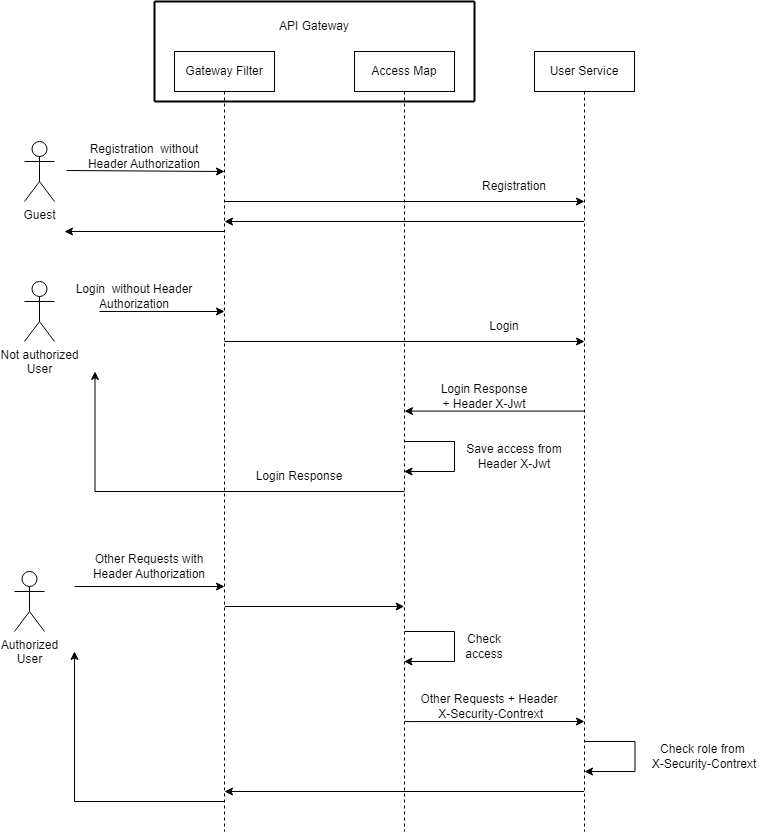

# Описание процесса регистрации и авторизации
Система состоит из API Gateway и микросервиса ms-user. API Gateway осуществляет роутинг запросов, а также хранит данные
об аутентификации пользователя и занимается ее проверкой по токену. 
Процесс регистрации, авторизации и остальные запросы описаны на sequence-диаграмме  
  
Настройка Security в Spring является наиболее сложным и времязатратным шагом (особенно нестандартные реализации).
Поэтому исключительно в учебных целях был написан свой мини-security с упрощениями с прицелом на микросервисы и на то, что
нужно будет создавать большое количество синтетических данных (поэтому полноценный OAuth не подойдет). 
По эндпойнту */registration* пишем в ms-user личные данные пользователя, а также пару логин-пароль. Логин проверяем на 
уникальность, пароль хэшируем bcrypt ("соль" только родная). Сила хэширования стандартная, время ответа около 1 сек. 
Сложность пароля не проверяется. 
По эндпойнту */login* осуществляем basic auth, если все верно, то возвращаем кастомный jwt-токен. 
Токен также пишем в кастомный хэдер *X-Jwt* (костыль для упрощения), с помощью которого записываем в Gateway в мапу username
Токен для упрощения сформирован не полностью корректно (названия полей токена взяты свои, не по OAuth спеке, а также сигнатура 
подписи не вычисялется). Опять же для упрощения не реализован полноценный механизм access-refresh, время жизни токена - 
24 часа. Токен помимо персданных пользователя содержит также exp (timestamp протухания), accessId 
(ID нашей 24 часовой типа сессии) и массив roles (роли пользователя). 
При выполнении остальных запросов необходимо прошивать токен (Bearer) в хэдер Authorization. Gateway парсит токен,  
находит в мапе по username пару exp-accessId и проверяет корректность ID-шника и не протух ли токен. Параметр exp в 
самом токене не служит для проверки, а лишь служит для отображения времени протухания при получении токена, подменять 
exp бесполезно. В случае непрохождения проверок на гейтвее падает **403** ошибка, в случае успеха центральная часть токена
прошивается в Base64 в хэдер *X-Sec-Context*. Запрос прокидывается в ms-user, где хэдер *X-Sec-Context* при каждом запросе 
парсится, мапится на объект CurrentUser (аналог Authorization или Principal) и потокобезопасно кладется в SecurityContext, 
откуда через Facade будет доступен в любой точке приложения в течение данного запроса.
В микросервисах над эндпойнтами с необходимостью авторизации установлена аннотация @HasRole с указанием требуемой роли (ролей).
При попадании request-а в такой контроллер происходит авторизация: по CurrentUser берутся все роли пользователя и 
сравниваются с требуемыми в "ручке", если все ок - то выполняется бизнес-логика. 

# Инструкция по сборке и развертыванию приложения
## Настройка окружения для сборки
Необходимое ПО:
* JDK, Java не ниже 11 версии. Можно установить OpenJDK 15 [отсюда](https://jdk.java.net/archive/), 
[по инструкции](https://timeweb.com/ru/community/articles/kak-ustanovit-java-development-kit). Обязательно установить
все переменные среды.
* Gradle версии не ниже 7.3.3, [отсюда](https://gradle.org/releases/). Установить 
[согласно мануалу](https://gradle.org/install/). Обязательно установить переменную среды USER_HOME к своей
пользовательской папке. Например, на win это C:\Users\MyUser.
## Сборка (обязательна как для локального развертывания, так и для развертывания с docker-compose)
Проект состоит из двух библиотек: API (lib-api) и стартеров (lib-starter), а также из API Gateway (auth-gateway) и 
микросервиса пользователей (ms-user). Библиотеки собираются и включаются в состав сборки сервисов.
Порядок сборки:
1) Cобрать lib-api. 
   * Из IDEA - запустить Run Configuration **build & publish to local**   
   * Без IDEA - открыть командную строку в папке lib-api, выполнить команду
     ~~~ 
     gradle build publishMavenPublicationToMavenLocal -x test
     ~~~
     После успешного выполнения команды в консоль выведется:
       
     и все модули lib-api упадут в папку %USER_HOME%\.m2\repository\ru\morningcake
       
2) Cобрать lib-starter. Сборка аналогична lib-api.
   * Из IDEA - запустить Run Configuration **build & publish to local**
   * Без IDEA - открыть командную строку в папке lib-starter, выполнить команду
     ~~~ 
     gradle build publishMavenPublicationToMavenLocal -x test
     ~~~
     После успешного выполнения команды в консоль выведется:
       
     и все модули lib-starter упадут в папку %USER_HOME%\.m2\repository\ru\morningcake
       
3) Cобрать auth-gateway и ms-user.
   * Из IDEA - запустить Run Configuration **build**   
   * Без IDEA - открыть командную строку в папке lib-starter, выполнить команду
     ~~~ 
     gradle build -x test
     ~~~
     После успешного выполнения команды в консоль выведется:
       
     и в папке с проектом появится папка build, где в папке build/lib появится jar-файлы для запуска. 
## Настройка окружения для локального развертывния
Необходимое ПО:
* postresql не ниже 12 версии, развернутый локально или на виртуалке. 

Желательное ПО:
* Intellij IDEA (для упрощения сборки и запуска).
## Развертывание локально
1) Развертывание auth-gateway
   * Из IDEA - запустить Run Configuration **App**   
   * Без IDEA - открыть командную строку в папке auth-gateway
     ~~~ 
     java -jar build/libs/auth-gateway.jar --server.port=11555 --spring.profiles.active=local
     ~~~
     После успешного выполнения команды в консоль выведется:
     ~~~
       .   ____          _            __ _ _
      /\\ / ___'_ __ _ _(_)_ __  __ _ \ \ \ \
     ( ( )\___ | '_ | '_| | '_ \/ _` | \ \ \ \
      \\/  ___)| |_)| | | | | || (_| |  ) ) ) )
       '  |____| .__|_| |_|_| |_\__, | / / / /
      =========|_|==============|___/=/_/_/_/
      :: Spring Boot ::               (v2.7.14)
     ...
     ...
     2024-07-10 15:23:38.369  INFO 11608 --- [           main] o.s.b.w.embedded.tomcat.TomcatWebServer  : Tomcat started on port(s): 11555 (http) with context path ''
     2024-07-10 15:23:39.636  INFO 11608 --- [           main] r.m.agw.AuthGatewayApplication           : Started AuthGatewayApplication in 9.456 seconds (JVM running for 10.43)
     ~~~
     Приложение будет запущено на порту 11555.  
2) Развертывание ms-user
   * Предварительно запустить сервер postgres, создать БД (по умолчанию, otus_highload) и схему otus_user.
   * Из IDEA - запустить Run Configuration **UserApp with params** , ***прокинув в настройке конфига
     строку подключения к БД, логин и пароль пользака БД***  
      
   * Без IDEA - открыть командную строку в папке ms-user, выполнить команду, выполнить команду, ***прокинув в команду
     строку подключения к БД, логин и пароль пользака БД***
     ~~~ 
     java -jar build/libs/ms-user.jar --server.port=11100 --spring.profiles.active=local --spring.datasource.url="jdbc:postgresql://localhost:5432/otus_highload" --spring.datasource.username="postgres" --spring.datasource.password="root"
     ~~~
     После успешного выполнения команды в консоль выведется:
     ~~~
       .   ____          _            __ _ _
      /\\ / ___'_ __ _ _(_)_ __  __ _ \ \ \ \
     ( ( )\___ | '_ | '_| | '_ \/ _` | \ \ \ \
      \\/  ___)| |_)| | | | | || (_| |  ) ) ) )
       '  |____| .__|_| |_|_| |_\__, | / / / /
      =========|_|==============|___/=/_/_/_/
      :: Spring Boot ::               (v2.7.14)
     ...
     ...
     2024-07-10 15:32:56.509  INFO 5844 --- [           main] o.s.b.w.embedded.tomcat.TomcatWebServer  : Tomcat started on port(s): 11100 (http) with context path ''
     2024-07-10 15:32:57.136  INFO 5844 --- [           main] ru.morningcake.UserApplication           : Started UserApplication in 13.753 seconds (JVM running for 14.774)
     ~~~
     Приложение будет запущено на порту 11100. Порт менять не стоит, т.к. поломается роутинг с гейтвея.

## Необходимое ПО для развертывания c docker-compose
docker и docker-compose (для linux) или docker desktop для win.
## Развертывание c docker-compose
1) Осуществить сборку
2) Запустить консоль в корне проекта, запустить docker-compose
~~~
 docker-compose -f .\docker-compose.yml up -d
~~~
3) В результате получим собранные образы 
 
А также, получим собранные поднятые контейнеры 
 

## Запросы в Postman
Постман-коллекция лежит [в папке postman](postman/2024-07-10__OTUS.postman_collection.json).
Все запросы параметризованные, достаточно просто прогнать их подряд, предварительно проинициализировав переменные:
* login и password - любыми символами
* token - оставить пустым
* agw uri - http://localhost:11555/api
 
Негативные кейсы (дубль username при регистрации, несовпадение username или accessId, отсутствие необходимых ролей, 
несоответствие АПИ) не приведены. Можно нарулить, исходя из введенных данных.

## API
Можно открыть файлы с апишкой (lib-api) через openapi(swagger)-редактор или плагин IDE. 
 