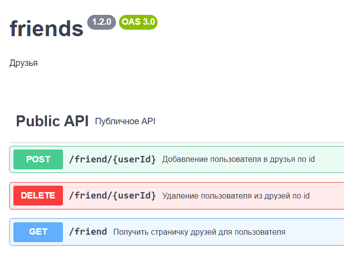
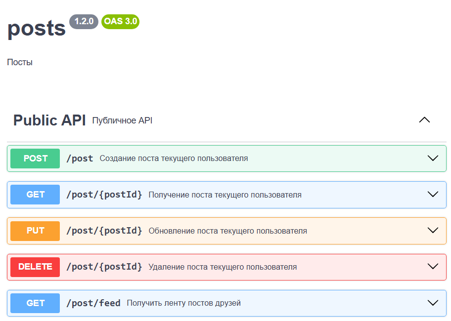
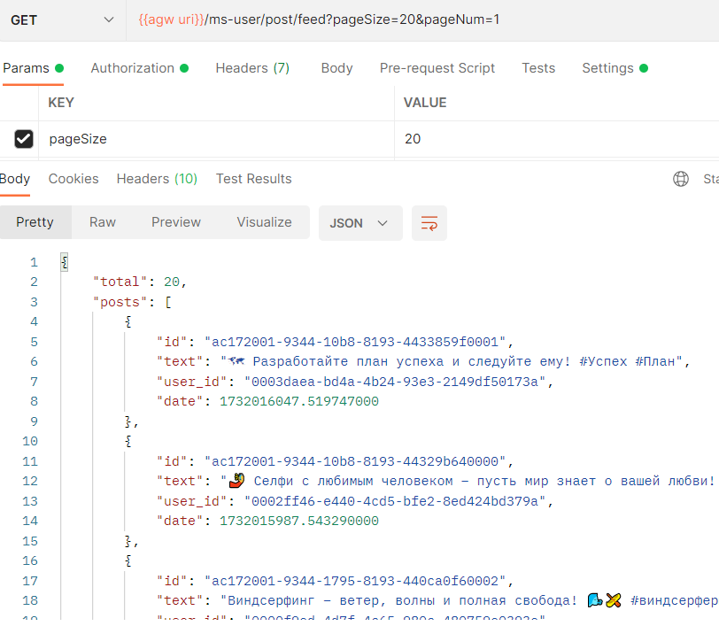
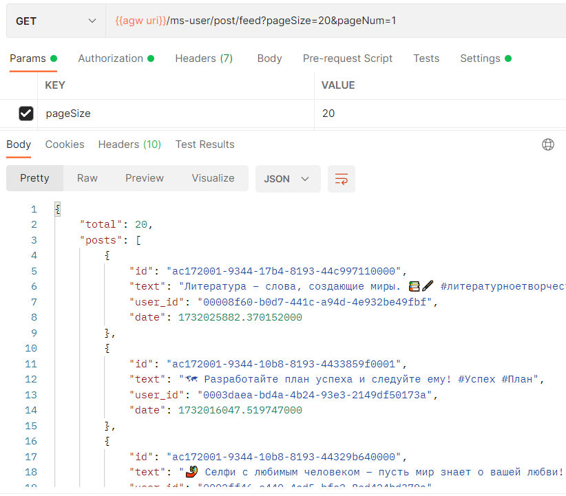

# ЗАДАНИЕ 4 - Кэш
## Реализация кэша
Система состоит из двух микросервисов: auth-gateway и ms-user (см. [README.md](README.md)).
Там же инструкция по развертыванию.
Для удовлетворения условий задачи (кэш ленты постов друзей на 1000 элементов) был создан свой велосипед - кэш на уровне
сервиса ms-user [класс FifoCache](ms-user/src/main/java/ru/morningcake/component/FifoCache.java) \
Кэш состоит из логически связанных структур:
* словарь кэшей (словари ключ-значение) для каждого пользователя ConcurrentHashMap<UserId, Map<ID, Data>> 
* словарь двусторонних очередей ключей для каждого пользователя ConcurrentHashMap<UserId, ArrayDeque<ID>>.\

Словарь кэшей содержит данные и служит для быстрого доступа к ним по ключу, а очередь служит для реализации стратегии
выталкивания FIFO самого старшего элемента. При первом обращении к кэшу данные берутся из БД, а кэш прогревается на всю
возмжную глубину (т.е. на максимум значений из БД либо максимум длины кэша (если значений больше, чем размер кэша)).\
Лок реализован под капотом словарей ConcurrentHashMap.
Также особенностью кэша является реализация пагинации за счет того, что очередь ключей нативно использует индексированный
массив и обеспечивает логический порядок данных в порядке убывания даты создания.

## API
В API были добавлены следующие методы:

 

  
**GET** ***/post/feed*** как раз берет данные из кэша.
С помощью процедуры в миграции данных *otus_user._proc__addRandomFriendsAndPosts()* был создан юзер, 100 друзей и их посты.
Далее запущена джоба, которая раз в период слчайным образом публикует посты от имени пользователей и обновляет кэш.
Список из 1250 текстов постов сгенерен LLM и случайным образом выпадает при создании поста.\
На рисунке ниже - кэш прогрет.

  
На следующем рисунке отработал эмулятор (1 пост). Пост из конца очереди кэша было вытеснен, новый пост закэширован
в начало очереди.
